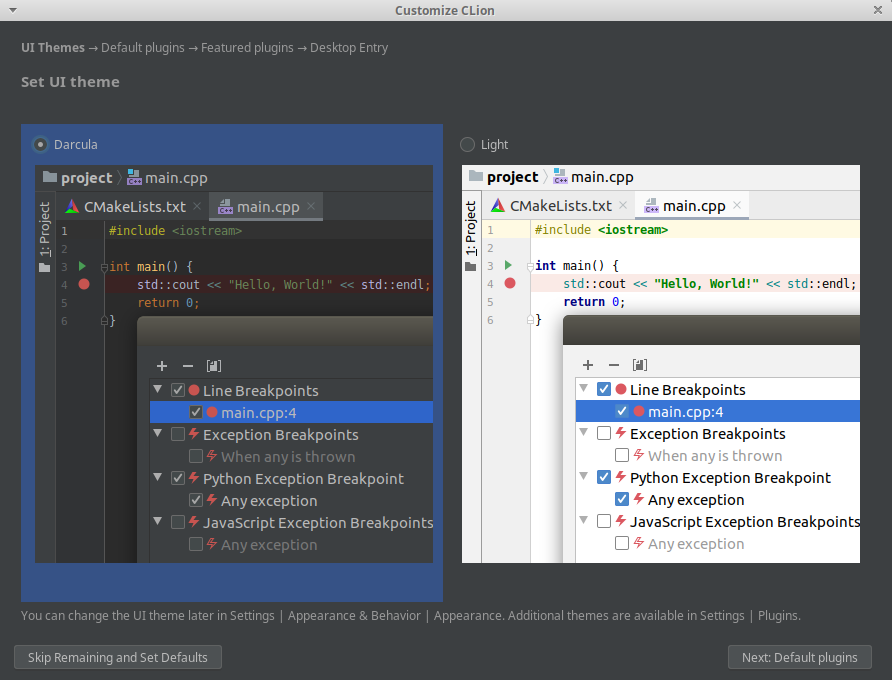
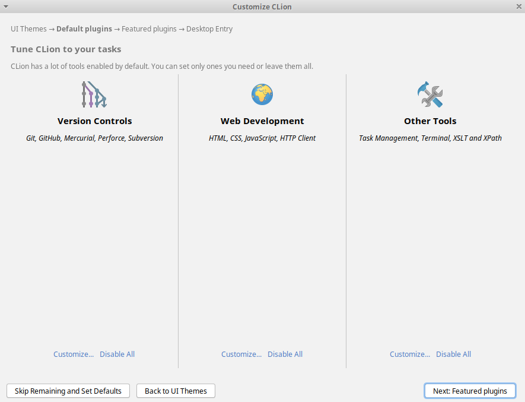
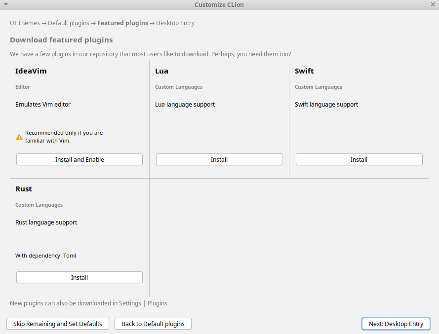
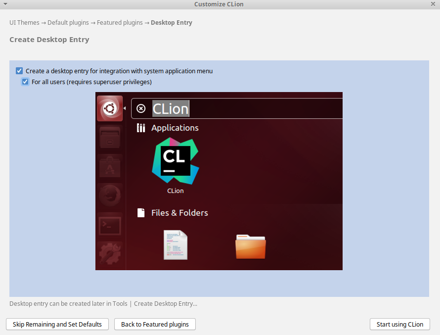
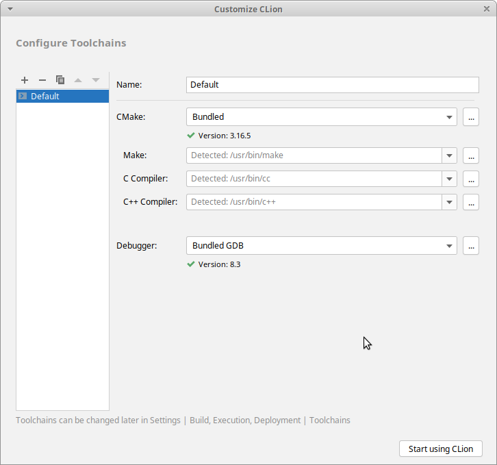
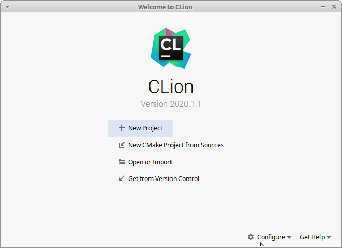
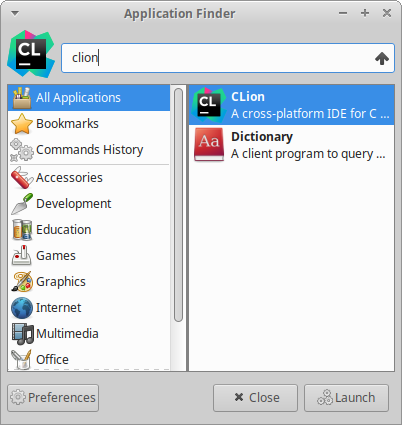
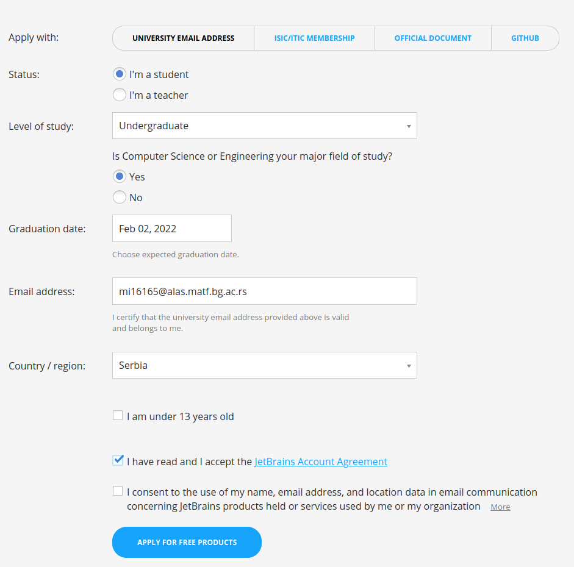
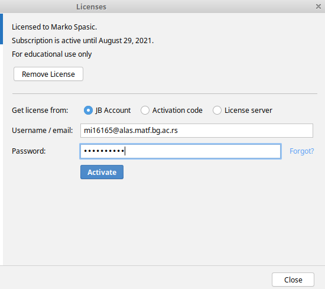
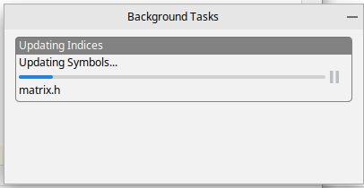

# Uputstva

## CLion
CLion je integrisano razvojno okruženje namenjeno za programske jezike C i C++.

Bazirano je na IntelliJ okruženju koje se koristi na predmetu OOP.

### Ubuntu 16.04+
Pre instalacija obavezno poreknuti komande u terminalu:

`sudo apt-get install g++ cmake git build-essential`

Onda će CLion moći automatski da ih pronađe i konfigurše okruženje.

0) Ukoliko imate Ubuntu 16.04 ili noviju verziju u terminalu pokrenuti:

`sudo snap install clion --classic`

### Postupna instalacija

1) Skinuti CLion sa stranice https://www.jetbrains.com/clion/download/#section=linux

2) Preuzeti fajl CLion-NekiDatumStojiOvde.tar.gz otpakovati u željeni folder

3) cd clion-2020.2.4/bin/

4) sudo ./clion.sh

5) Program će se pokrenuti. Odaberite temu.

6) Osim ako ne želite drugačije, naredna podešavanja možete ostaviti na podrazumevano:

7) To je sve.

8) CLion će biti dostupan kao aplikacija na sistemu. Može se pokretati preko prečice.

9) https://www.jetbrains.com/community/education/#students

Potrebno je registrovati besplatnu studentsku licencu. Kliknuti na plavo `Applay now` dugme.
Nakon toga popuniti formular i obavezno uneti *alas* mejl adresu.

Na alas mejl adresu će stići mejl za potvrdu. Nakon potvrde naloge dobija se studentska
licenca.

10) Aktivirati studentsku licencu preko JetBrains naloga koji ste upravo napravili.

-Kada se projekat prvi put učita okruženju je ponekad potrebno vremena da indeksira sve fajlove.
Nakon indeksiranja biće dostupne funkcije okruženja koje pomažu u radu kao što su dokumentacija,
predlaganja, pronalaženje simbola u projektu i slično.

## Github  
1) https://github.com/  
2) Sign up.  
3) Unesite svoje informacije. Mejl ne mora biti sa alasa.  
4) Potvrdite nalog.  
5) [SSH key i kloniranje repozitorijuma](https://www.youtube.com/watch?v=Z3ELWci34cM)  
6) [Kreiranje SSH kljuca](https://www.youtube.com/watch?v=WgZIv5HI44o)  

## Šta radi FileSystem::getPath?

U [repozitorijumu](https://github.com/matf-racunarska-grafika/LearnOpenGL/) radni direktorijum svakog programa je bin/*redni_broj_poglavlja*/.

Na primer, kada pokrenemo 1.1.getting_started/3.3.shaders_class, radni direktorijum iz kojeg se startuje program je
bin/1.1.getting_started relativno od korenog direkotrijuma projekta.

U primerima u repozitrijumu se fajl koji sadrži izvorni kod nekog šejdera nalazi u istom direktorijumu kao 
i izvorni kod tog primera. Tako se šejderi za 1.1.getting_started/3.3.shaders_class nalaze u direktorijumu
src/1.1.getting_started/3.3.shaders_class. Kada se bilduje ceo projekat šejderi se iskopiraju
u bin/*redni_broj_poglavlja*. Zbog toga u repozitorijumu kada se koristi šejder klasa kao na [primer](https://github.com/matf-racunarska-grafika/LearnOpenGL/blob/master/src/1.getting_started/3.3.shaders_class/shaders_class.cpp) na liniji 50 navodi se samo ime šejdera.

Kada smo kucali na času, u project_base šederi si nalaze na putanji resources/shaders/, a radni direktorijum projekta pri pokretanju je
koreni direktorijum projekta. Zato smo navodili resources/shaders/vertexShader.vs na primer.

U [repozitorijumu](https://github.com/matf-racunarska-grafika/LearnOpenGL/)  svim primerima susrešće te se sa funkcijom
FileSystem::getPath kao na [primer](https://github.com/matf-racunarska-grafika/LearnOpenGL/blob/master/src/1.getting_started/4.1.textures/textures.cpp) na
liniji 105.

To je opet zato što u tom repozirtorijumu radni direktorijum programa kada se pokrene je bin/*redni_broj_poglavlja* relativno od korenog direktorijuma
celog projekta, a teksture se nalaze u resources/textures. Sve što uradi FileSystem::getPath("resources/textures/container.jpg") je da pretvori
u "../../resources/textures/container.jpg".

Kada radimo sa project_base ne koristimo FileSystem::getPath jer je radni direktorijum programa postavljen da bude koreni direktorijum programa.
Implementacija FileSystem::getPath je za project_base izmenjena tako da odgovara toj razlici. Copy-paste primeri bi trebalo da rade bez problema,
samo treba osigurati da su šejderi u resources/shaders/ i da svaki put kada učitavamo šejder navedemo punu putanju
resources/shaders/vertexShader.vs.

Ili se šejderi mogu staviti u koreni direktorijum projekta.

